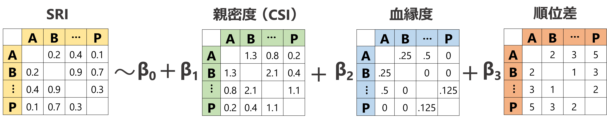

## Network permutation  {#s4-2}   
### Node permutationの手法  
Network permutationには大きく分けて<u>辺</u>をシャッフルする**edge permutation**と、<u>ノード</u>をシャッフルする**node permutation**に分けられるが、本節ではより一般的に用いられている後者についてのみ解説を行う。前者は生物のネットワークではあまり用いられないため[@Croft2011; @Farine2017]、ここでは解説しない。  

Node permutationでは、ノードの属性(性別、順位など)をランダムにシャッフルして生成したランダムなネットワークにおける統計検定量の分布を帰無分布とし、実際のデータの統計検定量をそれと比較することで有意性を判定する方法である。これにより、ネットワークの構造(e.g., ノード数、辺の数、密度など)や属性ごとのノード数(e.g., 性別の場合、オスとメスの数)を一定にしたまま検定を行うことができる。    

例えば、5個体からなる集団において、個体の社会的順位と固有ベクトル中心性の相関の有意性を検定するとしよう。Node permutationでは、以下のような手順で検定を行う(\@ref(s4-1)も参照)。  

1. 観察データからネットワークを生成する。  
ここでは、図\@ref(fig:fig-nlperm)のORIGINALが得られたとする   

2. 1で作成した社会ネットワークに対して統計分析を行い、統計検定量を算出する。  
ここでは相関係数を算出し、-0.83だったとする(図\@ref(fig:fig-nlperm))。  

3. ノードの属性(ここでは個体名とその順位)をランダムにシャッフルし、ランダムネットワークを多数作成する(図\@ref(fig:fig-nlperm)のPERMUTATION1 ~ PERMUTATION1000)。通常は少なくとも1000回は行う。    

4. すべてのランダムなネットワークにおける相関係数を算出する(図\@ref(fig:fig-nlperm))。　　

```{r fig-nlperm, fig.cap = "Node permutationの例", echo = FALSE, fig.align = "center", fig.dim = c(13.5,4)}

mat <- matrix(c(0,3,0,1,0,
                3,0,1,0,0,
                0,1,0,0,1.5,
                1,0,0,0,0,
                0,0,0,3,0),
                ncol = 5, nrow = 5)

colnames(mat) <- c("A","B","C","D","E")
rownames(mat) <- c("A","B","C","D","E")

mat %>% 
  as_tbl_graph() %>% 
  ggraph(layout = "circle")+
  geom_node_point(shape = 16, size = 8, aes(color = name))+
  geom_edge_link(aes(width = weight),
                 start_cap = circle(0.3,"cm"),
                 end_cap = circle(0.3,"cm"))+
  scale_edge_width(range = c(0.5,2.5))+
  geom_node_text(aes(label = name), color = "white")+
  scale_x_continuous(expand = c(0.15,0.15))+
  scale_y_continuous(expand = c(0.1,0.1))+
  theme(legend.position = "none",
        aspect.ratio = 1,
        panel.background = element_rect(fill = "white"))+
  annotate(geom = "text", x = 0.5,y=0.8, 
           label = expression(paste(italic("r")," = -0.83")), parse = TRUE,
           vjust = 0, hjust = 0, size = 5)+
  labs(title = "ORIGINAL")-> p1

colnames(mat) <- c("B","D","A","E","C")
rownames(mat) <- c("B","D","A","E","C")

mat %>% 
  as_tbl_graph() %>% 
  ggraph(layout = "circle")+
  geom_node_point(shape = 16, size = 8, aes(color = name))+
  geom_edge_link(aes(width = weight),
                 start_cap = circle(0.3,"cm"),
                 end_cap = circle(0.3,"cm"))+
  scale_edge_width(range = c(0.5,2.5))+
  geom_node_text(aes(label = name), color = "white")+
  scale_x_continuous(expand = c(0.15,0.15))+
  scale_y_continuous(expand = c(0.1,0.1))+
  theme(legend.position = "none",
        aspect.ratio = 1,
        title = element_text(size = 10, face = "bold"))+
  annotate(geom = "text", x = 0.5,y=0.8, 
           label = expression(paste(italic("r")," = -0.23")), parse = TRUE,
           vjust = 0, hjust = 0, size = 5)+
  labs(title = "PERMUTATION 1")-> p2

colnames(mat) <- c("C","A","E","B","D")
rownames(mat) <- c("C","A","E","B","D")

mat %>% 
  as_tbl_graph() %>% 
  ggraph(layout = "circle")+
  geom_node_point(shape = 16, size = 8, aes(color = name))+
  geom_edge_link(aes(width = weight),
                 start_cap = circle(0.3,"cm"),
                 end_cap = circle(0.3,"cm"))+
  scale_edge_width(range = c(0.5,2.5))+
  geom_node_text(aes(label = name), color = "white")+
  scale_x_continuous(expand = c(0.15,0.15))+
  scale_y_continuous(expand = c(0.1,0.1))+
  theme(legend.position = "none",
        aspect.ratio = 1,
        title = element_text(size = 10, face = "bold"))+
  annotate(geom = "text", x = 0.5,y=0.8, 
           label = expression(paste(italic("r")," = 0.12")), parse = TRUE,
           vjust = 0, hjust = 0, size = 5)+
  labs(title = "PERMUTATION 2")-> p3

mat %>% 
  as_tbl_graph() %>% 
  ggraph(layout = "circle")+
  theme_graph()+
  annotate(geom = "text",
           x = 0, y = 0, size = 10,
           label = "・・・")+
  theme(aspect.ratio = 1)+
  labs(title = "・・・")+
  theme(plot.title = element_text(hjust = 0.5))-> p4

colnames(mat) <- c("B","A","C","E","D")
rownames(mat) <- c("B","A","C","E","D")

mat %>% 
  as_tbl_graph() %>% 
  ggraph(layout = "circle")+
  geom_node_point(shape = 16, size = 8, aes(color = name))+
  geom_edge_link(aes(width = weight),
                 start_cap = circle(0.3,"cm"),
                 end_cap = circle(0.3,"cm"))+
  scale_edge_width(range = c(0.5,2.5))+
  geom_node_text(aes(label = name), color = "white")+
  scale_x_continuous(expand = c(0.15,0.15))+
  scale_y_continuous(expand = c(0.1,0.1))+
  theme(legend.position = "none",
        aspect.ratio = 1,
        title = element_text(size = 10, face = "bold"))+
  annotate(geom = "text", x = 0.5,y=0.8, 
           label =   expression(paste(italic("r")," = -0.45")), 
           parse = TRUE,
           vjust = 0, hjust = 0, size = 5)+
  labs(title = "PERMUTATION 1000") -> p5

p1+p2+p3+p4+p5 + plot_layout(ncol = 5)
```
<br/>  

5. ランダムなネットワークから算出された相関係数の分布を帰無分布とし、実際の相関係数がこれらの何%より大きい(または小さい)かを算出する(図\@ref(fig:fig-nlperm2))。これが$P$値になる。このように、片側検定が用いられることが多い。ここでは、ランダムネットワークの相関係数の5/1000しか実測値より小さくないので、$P = 0.005$となり有意な負の相関があるという結論が得られる。  

```{r fig-nlperm2, fig.cap = "Node permutationでの検定の例", echo = FALSE, fig.align = "center", fig.dim = c(4.5,3.5)}
## ヒストグラムの例
attr <- data.frame(ID = c("A","B","C","D","E","F","G","H"),
                   rank = c(2,5,4,3,1,7,8,6))

attr_eigen <- met.eigen(mat_undir_b, df = attr, dfid = 1)
r_real <- cor.test(attr_eigen$rank,attr_eigen$eigen, method = "s")$estimate

r_rand <- rep(0,1000)

for(i in 1:1000){
  random_net <- rmperm(mat_undir_b)
  r_rand[i] <- cor.test(attr$rank, met.eigen(random_net))$estimate
}

data.frame(x = r_rand) %>% 
  ggplot(aes(x=x))+
  geom_histogram(binwidth = 0.05)+
  geom_vline(xintercept = r_real, color = "red4", size = 1.5)+
  annotate(geom = "text", x = -0.8, y = 58,
           label = "r(実測値) > r(ランダム): 5/1000 \nよって、p = 0.005",
           hjust = 0)+
  theme_bw()+
  scale_x_continuous(expand = c(0,0.1,0,0.1))+
  scale_y_continuous(expand = c(0.01,0,0.1,0))+
  annotate(geom = "text", x = -0.8, y = 70,
           label = "r(実測値): -0.83", hjust = 0, color = "red4")+
  labs(x = "ランダムネットワークでの相関係数の値",
       y = "frequency") -> p6

p6
```

### 分析例  
Node permutationは様々な分析に適用可能である。以下では、実際の分析例をいくつか見ていく。  

#### 線形モデル(GLM、GLMMなど)    
一般化線形モデル(GLM)や一般化線形混合モデル(GLMM)をはじめとした線形モデルは、2つ以上の変数間の関連を調べるうえで非常に有用な分析である[@Ohigashi2010; @Dunn2018]。これらの手法は、社会ネットワーク分析でノードレベルの検定(e.g., 各個体の属性と中心性指標の関連など)を行う際にも非常に有用である[@Farine2017]。  

GLMやGLMMでは、何かの原因となっていると想定される変数を**説明変数**(以下、$x$とする)、それを受けて変化すると想定される変数を**応答変数**(以下、$y$とする)という。

##### 分析例1. 正規線形モデル   
以下では、シンプルな例として応答変数が正規分布から得られていると仮定するモデルを用いた分析を行う。金華山島$B_1$群において、個体追跡中の6歳以上のメス間の近接時間割合を算出したところ、以下の隣接行列(`prox_mat`, \@ref(tab:tab-prox))が得られたとする。  

```{r}
## マトリックスの読み込み  
prox_mat <- read.csv("data/prox_f.csv",row.names=1) %>% 
  as.matrix()  

## マトリックスをアルファベット順で並び替え
prox_mat <- prox_mat[sort(rownames(prox_mat)), sort(colnames(prox_mat))]

## 体格成分を0に
diag(prox_mat) <- 0　　
```

```{r tab-prox, echo = FALSE}
prox_mat %>% 
  kable(digits = 2, align = "c", caption = "近接時間割合の隣接行列") %>% 
  kable_styling(font_size = 5, full_width = FALSE)
```

<br/>  

このネットワークにおいて、<u>各メスの固有ベクトル中心性(`eigen`)と順位(`rank`)・年齢(`age`)との関連を調べる</u>ため、以下のモデルを考える。ただし、添え字の$i$はそれが$i$番目の個体のデータであることを表す($i = 1,2,3,...,16$)。  

$\beta_0$はモデルの切片を、$\beta_1$と$\beta_2$はそれぞれ順位と年齢が1増えたときに、固有ベクトル中心性がどのくらい上昇すると期待されるかを表す(= **回帰係数**)。また、2行目の数式は、$i$番目の個体の固有ベクトル中心性($eigen_i$)が、平均$\mu_i$、分散$\sigma$の正規分布から得られることを表す。GLMやGLMMでは、実際のデータが得られる確率が最も高くなるようにモデルのパラメータ(ここでは、$\beta_0, \beta_1, \beta_2. \sigma$)を推定していく。      

$$
\begin{aligned}
\mu_i &= \beta_0 + \beta_1 \times rank_i + \beta_2 \times age_i  \\
eigen_i &\sim Normal(\mu_i, \sigma)
\end{aligned}
$$

それでは、分析に移ろう。すでに隣接行列を算出してネットワークを作成しているので、個体ごとの固有ベクトル中心性を算出する(**Step2**)。個体ごとの属性を`att_females`としてデータフレームにまとめる(第\@ref(s2-2)参照)。    
```{r}
## 属性データの作成
att_females <- data.frame(femaleID = colnames(prox_mat),
                          rank = c(8,9,11,12,1,2,3,5,4,13,15,14,6,7,10),
                          age = c(12,9,10,10,14,7,12,8,6,8,10,15, 10, 10, 10))

## 算出  
att_females <- met.eigen(prox_mat,
                         df = att_females,
                         dfid = 1,
                         sym = TRUE)
```

算出結果は以下のようになった。  
```{r}
att_females %>% 
  datatable(rownames = FALSE)
```
<br/>  

算出結果からプロットを作成したところ、順位と固有ベクトル中心性の間には負の関連がありそうなことがわかる(図\@ref(fig:fig-cor))。    
```{r fig-cor, echo = FALSE, fig.dim = c(10,4.5), fig.cap = "固有ベクトル中心性(`eigen`)と順位(`rank`)・年齢(`age`)との関連"}
att_females %>% 
  ggplot(aes(x = rank, y = eigen))+
  geom_point(size = 6)+
  theme_bw(base_size = 16)+
  theme(aspect.ratio = 1) -> p1

att_females %>% 
  ggplot(aes(x = age, y = eigen))+
  geom_point(size = 6)+
  theme_bw(base_size = 16)+
  theme(aspect.ratio = 1) -> p2

p1 + p2
```
<br/>  

続いて、先ほどの数式に基づいたモデリングを行う。Rでは以下のコードで実行することができる。  
```{r}
r_glm <- lm(data = att_females,
           formula = eigen ~ rank + age)
```

モデリングの結果推定された$\beta_0$、$\beta_1$、$\beta_2$の推定値は以下のようになる。なお、`Intercept`は切片を表す。    
```{r}
r_glm
```

パーミュテーション検定では、$\beta_1$や$\beta_2$などの**回帰係数**を統計検定量として検定を行うことで、説明変数と応答変数の関連が有意であるかをしらべることが推奨されている[@Farine2017]。そこで、それぞれの推定値を持つオブジェクトを作成する(`b_rank`と`b_age`)。  
```{r}
b_rank <- coef(r_lm)[[2]]
b_age <- coef(r_lm)[[3]]
```

```{r, echo = FALSE}
coef_real <- data.frame(b_rank = b_rank,
                        b_age = b_age) %>% 
  pivot_longer(cols = 1:2, names_to = "coef", values_to = "value") %>% 
  mutate(label = str_c("実測値: ", sprintf("%.2f", value)),
         y = c(50,30)) %>% 
   mutate(coef = fct_relevel(coef, "b_rank"))
```

###### `sna`パッケージを用いる方法  
続いて、node permutationを行ってランダムなネットワーク(隣接行列)を1000個生成し、それぞれのネットワークにおいて同じ回帰分析を行い、先ほど同様に$\beta_1$と$\beta_2$の推定値を算出する(**Step3~4**)。  

Rでは、`sna`パッケージの`rmperm`関数でnode permutationを行うことができる。`b_rank_rand`と`b_rank_age`という空のベクトルを作成し、そこにランダムネットワークから算出された$\beta_1$と$\beta_2$を入れている。  

```{r}
## 空の行列を作成
b_rank_rand <- rep(0,1000)
b_age_rand <- rep(0,1000)

set.seed(123)

for(i in 1:1000){
  random_net <- rmperm(prox_mat)
  att_females_rand <- met.eigen(random_net, df = att_females)
  r_lm_rand <- lm(data = att_females_rand,
                  formula = eigen ~ rank + age)
  b_rank_rand[i] <- coef(r_lm_rand)[[2]]
  b_age_rand[i] <- coef(r_lm_rand)[[3]]
}
```

それでは、最後に実データの回帰係数をランダムネットワークの回帰係数の分布と比較する(図\@ref(fig:fig-npermtest))。灰色のヒストグラムがランダムネットワークの回帰係数の分布を、赤い線が実データの回帰係数を表している。$\beta_1$については、有意な値だといえそうだ。  

```{r fig-npermtest, echo = FALSE, fig.dim = c(10,4.5), fig.cap = "実データの回帰係数とランダムネットワークの回帰係数の分布の比較"}
labeller <- as_labeller(c("b_rank" = "beta[1]", "b_age" = "beta[2]"),
                        label_parsed)

data.frame(b_rank = b_rank_rand,
           b_age = b_age_rand) %>% 
  pivot_longer(cols = 1:2, names_to = "coef", values_to = "value") %>% 
  mutate(coef = fct_relevel(coef, "b_rank")) %>% 
  ggplot(aes(x = value))+
  geom_histogram(binwidth = 0.001)+
  geom_vline(data = coef_real,
             aes(xintercept = value),
             color = "red4",
             linewidth = 1)+
  geom_text(data = coef_real,
            aes(label = label, x = value+0.01, y = y),
            fontface = "bold",
            family = "Yu Gothic")+
  theme(aspect.ratio = 1,
        strip.background = element_blank(),
        strip.text = element_text(hjust = 0, size = 20, family = "Yu Gothic"))+
  facet_rep_wrap(~coef, repeat.tick.labels = TRUE, scales = "free",
                 labeller = labeller)

p_rank <- sum(b_rank > b_rank_rand)/1000
p_age <- sum(b_age > b_age_rand)/1000
```
<br/>  

そこで、実データの回帰係数がランダムネットワークの回帰係数の何%より大きいか/小さいかを計算することで、$P$値を算出する。  
算出は以下のように行える。  

順位の係数($\beta_1$)については、P = `r sprintf("%.3f",p_rank)`なので、有意な関連があると結論付けられる。
```{r}
p_rank <- sum(b_rank > b_rank_rand)/1000

p_rank
```

一方で、年齢の係数($\beta_2$)については、P = `r sprintf("%.3f",p_age)`なので、帰無仮説は棄却されない。  
```{r}
p_age <- sum(b_age > b_age_rand)/1000

p_age
```
<br/>  

###### `ANTs`パッケージを用いる方法  
ここまで行ったnode permutation検定のstep3以降は、`ANTs`パッケージを用いるとより簡単に行うことができる。  

`ANTs`パッケージでは、個体の属性や中心性指標が入ったデータフレームを用いて、node permutationを行うことができる。  
`perm.net.nl`関数では、指定されたラベル(今回の場合は、応答変数である固有ベクトル中心性)について、指定した数だけパーミュテーションを行ってくれる(やっていることは`sna`パッケージを用いた場合と同じ)。  
```{r, warning = FALSE, message = FALSE}
set.seed(123)

perm_lm <- perm.net.nl(## 算出した固有ベクトル中心性と属性を含むデータフレーム  
  　　　　　　　　　　　att_females,
                        ## パーミュテーションするラベル。ここでは固有ベクトル中心性  
                        labels = c("eigen"),
                        ## 回数  
                        nperm = 1000,
  　　　　　　　　　　　progress = FALSE)
```

続いて`stat.glm`関数を用い、実データとランダムネットワークにおけるデータに対してモデリングを行い、パラメータの推定値を算出する。  このとき、相関係数の検定については`stat.cor`、t検定については`stat.t`、GLMMについては`stat.glmm`など、分析ごとに様々な関数が用意されている。詳細は[こちらのサイト](https://rdrr.io/github/SebastianSosa/ANTs/man/)を参照。  

```{r}
r_lm_b <- stat.glm(perm_lm,
              ## 式
              formula = eigen ~ age + rank,
              ## 応答変数が従う分布を指定。二項分布なら"binomial"、ポワソン分布なら"poisson"
              family = "gaussian",
              progress = FALSE)
```

分析結果は、`ant`関数を用いることで確認できる。  
モデルの診断プロット（残差 vs 予測値、QQプロット）および実データの回帰係数とランダムネットワークの回帰係数の分布の比較は以下のように可視化できる。  
```{r, fig.dim = c(12,5.5), fig.cap = "実データの回帰係数とランダムネットワークの回帰係数の分布の比較"}
r_lm_ants <- ant(r_lm_b)
```
<br/>  

検定結果は以下の通り。`p.left`と`p_right`はランダムネットワークの係数が実際の係数よりも小さい/大きい確率を表す。`sna`パッケージを用いた場合と概ね同じ結果が得られている。  
```{r}
r_lm_ants$coefficients
```

モデルの診断結果を`r_lm_ants$model.diagnostic`で調べることもできる。  

##### 分析例2. 線形混合モデル  
同様の分析は、モデルにランダム効果を入れたGLMMなどの混合モデルについても適用できる。GLMMについては、[こちら](https://kuboweb.github.io/-kubo/ce/LinksGlmm.html)  などを参照。複数の調査期間に/複数の集団でデータを収集した場合などにすべてのデータをまとめて分析する際には、GLMMが適用される[@Sosa2020]。    

例えば、ニホンザルの7つの集団(A~F)である年におけるメスの毛づくろいのデータを収集し、ダイアッドごとの毛づくろい頻度を算出したとしよう。以下の`list_mat`には、list形式で7つの隣接行列が収納されている(架空のデータである)。      

```{r}
list_mat <- readRDS("data/list_mat.obj")
```

例えば、3つ目の集団(C)の隣接行列は以下のようになっている(表\@ref(tab:tab-example3)。  
```{r tab-example3}
list_mat[[3]] %>% 
  kable(digits = 2, align = "c", caption = "3つめの隣接行列") %>% 
  kable_styling(font_size = 5, full_width = FALSE)
```
<br />  

これらの集団において、各個体の**固有ベクトル中心性が、その後10年間の産子数に影響しているか**調べたいとする。各集団における各メスの順位・年齢・産子数・集団名が以下の`list_att`にlist形式で入っている(もちろん架空のデータである)。    
```{r}
list_att <- readRDS("data/list_att.obj")
```

例えば、C集団の属性データは以下のようになる。  
```{r}
list_att[[3]] %>% 
  datatable(rownames = FALSE)
```
<br/>  

さて、これらのデータに対して仮説(**固有ベクトル中心性が、産子数に影響するか**)を検証するために以下のモデルを考える。ただし、添え字の$ji$はそれが$j$番目の集団の$i$番目の個体のデータであることを表す。なお、`eigen`、`rank`、`age`、`no_birth`はそれぞれ固有ベクトル中心性、順位、年齢、産子数を表す。  

$r_j$はランダム切片を表し、集団による産子数(`no_birth`)のばらつきがあることを示している。3行目の数式は、$j$番目の集団の$i$番目の個体の産子数($no\_birth_{ji}$)が、平均$\lambda_{ji}$のポワソン分布から得られることを表す。 

$$
\begin{aligned}
r_j &\sim Normal(0, \sigma)\\
\lambda_{ji} &= exp(\beta_0 + \beta_1 \times eigen_{ji} + \beta_2 \times rank_{ji} + \beta_3 \times age_{ji} + r_j)  \\
no\_birth_{ji} &\sim Poisson(\lambda_{ji})
\end{aligned}
$$

それでは、分析に移ろう。各集団ごとに固有ベクトル中心性を算出する(**Step2**)。`ANTs`パッケージでは、複数の隣接行列と属性データをそれぞれlist形式でまとめることで、以下のように複数のネットワークについて同時に中心性を算出できる。  
```{r}
list_att <- met.eigen(list_mat,
                      df = list_att)
```

C集団ついての算出結果は以下のようになった。  
```{r}
list_att[[3]] %>% 
  datatable(rownames = FALSE)
```
<br/>  

続いて、`perm.net.nl`関数を用いてnode permutationを行う(**Step3**)。今回のように複数のグループが含まれる集団では、各グループ内でnode permutationを行う。`rf = "group"`と指定してあげる。  

```{r}
perm_glmm <- perm.net.nl(list_att, 
                         ## 応答変数をシャッフルすることが多い  
                         labels = "no_birth",
                         nperm = 1000,
                         rf = "group",
                         progress = FALSE)
```

続いて、`stat.glmm`関数を用い、実データとランダムネットワークにおけるデータに対してモデリングを行い、パラメータの推定値を算出する(**Step4**)。ランダム切片は、`(1|group)`のように書いてformulaに加える。   

```{r}
r_glmm <- stat.glmm(perm_glmm,
              ## 式
              formula = no_birth ~ eigen + rank + age + (1|group),
              ## 応答変数が従う分布を指定。二項分布なら"binomial"、ポワソン分布なら"poisson"
              family = poisson(link = "log"),
              progress = FALSE)
```

分析結果は、`ant`パッケージを用いることで確認できる(**Step5**)。  
モデルの診断プロット（残差 vs 予測値、QQプロット）および実データの回帰係数とランダムネットワークの回帰係数の分布の比較は以下のようになる。  
```{r, fig.dim = c(12,5.5), fig.cap = "実データの回帰係数とランダムネットワークの回帰係数の分布の比較"}
r_glmm_ants <- ant(r_glmm)
```
<br/>  

検定結果は以下の通り。順位と年齢の有意な影響は確認されたが、固有ベクトル中心性の影響は有意でないという結果が得られた。  
```{r}
r_glmm_ants$coefficients
```

#### ネットワーク同士の関連の検討  
Node permutationはネットワーク同士の関連を調べる際にも用いられることが多い。  

##### ネットワーク間の相関の検定  
###### Mantel検定  
ネットワーク間の相関の検定方法として、よく知られているのがMantel検定[@Mantel1967]である。Mantel検定は一般的に以下の手順に沿って行う(2つの隣接行列の相関を調べる場合)。  

1. 2つの隣接行列の対応する行列成分同士の相関係数を算出する。このとき、Pearsonの積率相関係数、Spearmanの順位相関係数、Kendallの順位相関係数のどれでもよい。  

2. 一方の隣接行列に対してnode permutationを行い、もう一方の隣接行列との相関係数を1と同様に算出する。  

3. 2を少なくとも1000回行う。  

4. 実際の相関係数がnode permutationによって算出された相関係数の何％より大きい/小さいかをP値とし、相関係数の有意性を判断する。  

Rでは、`vegan`パッケージの`mantel`関数などでMantel検定を行うことができる。ただし、<u>今のところ`mantel`関数は方向性のない隣接行列にしか適用できない</u>点に注意。  

ここでは、第\@ref(c2)章で算出した方向性のない毛づくろい頻度ネットワーク`groom_mat_b`(表\@ref(tab:tab-groom-b))と出席データを基にしたSRIマトリックス`presence_mat`(表\@ref(tab:tab-SRI))の相関を求めてみる。  

まず、`groom_mat_b`にいる`Kuri`と`Tam`という個体は`presence_mat`にはいないので、それらの個体を除く。また、両方の隣接行列の名前順をアルファベット順に合わせる。  

```{r}
## KuriとTamを除く
groom_mat_b2 <- groom_mat_b[-c(10,15),-c(10,15)]

## アルファベット順に並び替える  
presence_mat <- presence_mat[sort(colnames(presence_mat)), sort(rownames(presence_mat))]
```

それでは、Mantel検定を行う。ここでは、いずれの隣接行列の値も正規分布からは外れているので、Spearmanの相関係数で検定を行う。結果は、P値(`Significance`)が0.05以上ということで有意ではない。  

```{r}
library(vegan)

mantel(groom_mat_b2, presence_mat,
       ## 相関係数の種類。"pearson"または"kendall"でもよい
       method = "spearman",
       ## node permutationの回数
       permutations = 1000)
```

Mantel検定では、第3の要因(これも隣接行列の形で表す)の影響を取り除いたうえでの相関係数(= *偏相関係数*)も算出することができる。ただし、マニュアルによるとPearsonの相関係数以外の値は信頼できないよう。  

ここでは、順位差(`rank_mat`)の影響を統制したうえで、先ほどの2つの隣接行列の相関を調べる。まず、順位差を入れた隣接行列を作成する。  

```{r}
data.frame(ID = colnames(presence_mat),
           rank = c(8,9,11,12,1,2,3,5,4,14,15,13,6,7,10)) -> rank

tidyr::crossing(ID1 = colnames(presence_mat),
                ID2 = colnames(presence_mat)) %>% 
  left_join(rank, by = c("ID1" = "ID")) %>% 
  left_join(rank, by = c("ID2" = "ID")) %>% 
  mutate(rank_diff = abs(rank.x - rank.y)) %>% 
  select(ID1,ID2,rank_diff)  %>% 
  mutate(rank_diff = as.numeric(rank_diff)) %>% 
  pivot_wider(names_from = ID2,
              values_from = rank_diff) %>% 
  column_to_rownames(var = "ID1") %>% 
  as.matrix() -> rank_mat
```

偏相関係数の検定は、`vegan`パッケージの`mantel.partial`関数で行うことができる。結果は、順位を統制しても毛づくろいネットワークとSRIネットワークに有意な相関はない。    
```{r}
mantel.partial(groom_mat_b2, presence_mat, 
               ## 統制する隣接行列
               zdis = rank_mat,
               ## パーミュテーション回数
               permutations = 1000)
```
<br/>  

###### Hemelrijkの行列相関検定  
ヘメリック[@Hemelrijk1990a; @Hemelrijk1990b]は、霊長類において互恵性が存在するかを検討するために、Kendallの順位相関係数を発展させたKr検定を考案している。この方法もnode permutationを用いたもので、<u>方向性のある隣接行列も扱うことができる</u>。詳細はヘメリックの論文を参照されたし[@Hemelrijk1990a; @Hemelrijk1990b]。`ANTs`パッケージの`stat.tauKr`関数はこの方法に基づく行列相関検定を行ってくれる。  

例えば、群れ内において毛づくろいの互恵性が成立しているか、つまり各ダイアッドが毛づくろいを交換しているかを調べたいとしよう。そのためには、方向性のある毛づくろい頻度隣接行列`groom_mat`(表\@ref(tab:tab-groom))とその転置行列(行と列を入れ替えた行列)の相関があるかを調べればよい。そうすれば、**ある個体にたくさん毛づくろいをしているほど、その相手からも毛づくろいされているか**、を調べることができる。転置行列は`t()`関数で求められる。

分析の結果は以下のようになる。`pR`と`pL`はランダムなネットワークの相関係数が実際の相関係数より大きい/小さい確率を表す。この結果から、両者の間には有意な相関があり、毛づくろいの互恵性が成り立っていることが示唆される。つまり、毛づくろいをたくさん行うほど、その個体から毛づくろいをされている。    

```{r}
stat.tauKr(X = groom_mat,
           ## 転置行列
           Y = t(groom_mat), 
           ## 対角成分は含まない
           omitDiag = TRUE,
           ## node permutationの回数
           nperm = 1000)
```

Kr検定では、第3の要因を統制した偏相関係数を検定することもできる。例えば、毛づくろいの互恵性が血縁度の影響を統制したうえでも成立するかを調べたいとする。  

まず、各ダイアッドの血縁度をまとめた隣接行列を読み込み、行名と列名の順番を`groom_mat`に合わせる。  
```{r}
kin_mat <- read.csv("data/kin_demo.csv", row.names = 1) %>% 
  mutate(across(1:17, ~{as.double(.x)})) %>% 
  as.matrix()

kin_mat <- kin_mat[sort(colnames(groom_mat)),sort(rownames(groom_mat))]
diag(kin_mat) <- 0
```

Kr検定の偏相関係数バージョンは以下のように行うことができる。`Tauxyz`が偏相関係数の値を表す。血縁度を統制したうえでも、毛づくろいの互恵性は成立していることがわかる。  
```{r}
stat.tauKr(X = groom_mat,
           Y = t(groom_mat),
           ## 統制する要因の隣接行列
           Z = kin_mat,
           ## 対角成分は含まない
           omitDiag = TRUE,
           ## node permutationの回数
           nperm = 1000)
```

同様の分析は、異なる行動から算出した2つの隣接行列に対しても適用できる。他の例については、 @Hemelrijk1990a , @Hemelrijk1990b , @Croft2019 などを参照。    

##### ネットワークデータを用いた回帰分析  
ネットワーク相関は有用な方法だが、2つ以上の変数を統制したい場合には用いることができない。また、相関分析では様々な形式のデータ(0/1データ、割合データ)などを扱う際に問題が生じることもある。これらの問題点を解決してくれるのが、**MRQAP検定**[@Dekker2007]と呼ばれる手法である。MRQAP検定は、簡単に言ってしまえばネットワークデータを用いた回帰分析である。Mantel検定などと同様に、2つ以上の隣接行列の対応する行列成分に対して回帰分析を施す。  

例えば、第\@ref(c2)章で算出したSRI隣接行列(表\@ref(tab:tab-SRI))が、親密度(CSI)、血縁度、順位差と関連しているかを調べたいとする。MRQAPでは、通常の**GLMやGLMMと同様に、こうした複数の隣接行列を用いた回帰分析を行うことができる**(図\@ref(fig:fig-mrqap))。また、`aninet`パッケージの`glmqap`関数を用いれば、**応答変数となる隣接行列の分布として様々なもの(e.g., 正規分布、ポワソン分布、二項分布など)を仮定することができる**ので、データ形式に合った適切な分析を行うこともできる。  

```{r fig-mrqap, echo=FALSE, out.width="100%", fig.cap="MRQAP検定のイメージ図"}

```
<br/>  

MRQAP検定では、通常のnode permutationを発展させたdouble semi-partialing (DSP)法を用いて係数の有意性を判定する。この方法では、回帰分析をした際の残差に対してnode permutationを行うことでP値を算出する。少し複雑なので、詳しい説明は @Dekker2007 や、 @Borgatti2022 を参照。DSP法を用いれば、強い多重共線性がある場合でも、正確にP値を算出することができる。  

それでは、実際に第\@ref(c2)章で算出したSRIが、メス間の親密度(CSI)、血縁度、順位差の影響を受けるかを検討してみよう。ここでは、先ほども用いたメス同士の毛づくろい頻度`groom_mat_b2`と近接時間割合を用いてCSIを算出するとする。CSIは以下の式で算出される[@Silk2006]。ただし、$N$はメス個体数である。    
<br/>  

- $G_{ij}$: メス$i$とメス$j$の毛づくろい時間割合    
- $P_{ij}$: メス$i$とメス$j$の近接時間割合    
- $\overline{G}: \frac{1}{N} \sum^{N}_{i=1}G_{ij}$  
- $\overline{P}: \frac{1}{N} \sum^{N}_{i=1}P_{ij}$  

$$
CSI_{ij} = \frac{\left(\frac{G_{i}}{\overline{G}} +\frac{P_{i}}{\overline{P}}\right)}{2}
$$
<br/>  

まず、メス間の近接時間割合を記した隣接行列を読み込み、行と列をアルファベット順に並べ替える。   
```{r}
## 読み込み
prox_mat <- read.csv("data/prox_f.csv", row.names = 1) %>% 
  as.matrix()

## 並べ替え
prox_mat <- prox_mat[sort(rownames(groom_mat_b2)), sort(colnames(groom_mat_b2))]
diag(prox_mat) <- 0
```

CSIは、`aninet`パッケージの`dyadic_csi`関数で以下のように簡単に求めることができる。  
```{r}
library(aninet)

list <- list(groom_mat_b2, prox_mat)

CSI_mat <- dyadic_csi(list)

## 列名と行名を追加
colnames(CSI_mat) <- colnames(prox_mat)
rownames(CSI_mat) <- rownames(prox_mat)
```

CSIの隣接行列は以下のようになる(表\@ref(tab:tab-CSI))。  
```{r tab-CSI, echo = FALSE}
CSI_mat %>% 
  kable(digits = 2, align = "c", caption = "CSIの隣接行列") %>% 
  kable_styling(font_size = 6, full_width = FALSE)    
```
<br />  

順位差の隣接行列も読み込み、同様に列名と行名をアルファベット順にする。  
```{r}
## 読み込み
rank_mat <- read.csv("data/rank_demo.csv", row.names = 1) %>% 
  as.matrix()

## 並び替え
rank_mat <- rank_mat[sort(colnames(CSI_mat)), sort(rownames(CSI_mat))]
diag(rank_mat) <- 0
```

先ほど読み込んだ血縁度の隣接行列から、SRI隣接行列に存在しない個体`Kur`と`Tam`を除く。  
```{r}
kin_mat_b <- kin_mat[-c(10,15),-c(10,15)]
```

それでは、MRQAP検定に移ろう。SRIは0~1の間をとる割合データであるため、**応答変数の分布は二項分布とする**。分析には、[aninetパッケージ](https://rdrr.io/github/MNWeiss/aninet/man/)を用いる[@Franks2021]。  

二項分布を仮定した分析では、SRIを算出した際の分母が必要になる。`get_denominator`関数で算出できる。  
```{r}
denom <- get_denominator(## 第2章で使用したgroup by individual形式のデータ
                         presence %>% dplyr::select(-date),
                         ## HWIを算出したなら"HWI"
                         index = "SRI",
                         ## 隣接行列の形式で出力.ベクトル形式なら"vector"。
                         return = "matrix")

## アルファベット順に並び替え
denom <- denom[sort(rownames(CSI_mat)),sort(colnames(CSI_mat))]
```

分析は以下の通り。    
```{r, message = FALSE, cache = TRUE}
## 出力があまりに長くなってしまうので、すでに出した結果を読み込む  

#r_qap <- glmqap(presence_mat ~ CSI_mat + rank_mat + kin_mat_b,
 #               ## 分母の隣接行列
  #              weights = denom,
   #             ## 分布は二項分布、ポワソン分布なら"poisson"、正規分布なら"gaussian"。
    #           family = "binomial",
     #          ## パーミュテーションの回数
      #          nperm = 1000,
       #        ## パーミュテーションの方法。通常はDSP法
        #        permutation = "DSP")

r_qap <- readRDS("output/r_qap.rds")
```

結果は以下の通り。P値は、`P(two-tailed)`というところに書いてある。CSI、血縁度、順位差のいずれもSRIとは有意に関連していないという結果になった。  
```{r}
r_qap
```
<br/>  

### Node permutationの欠点  
以上でみたように、node permutationは2つ以上の変数の関連を調べるうえで強力な方法である。一方で、この方法は観察にバイアスがあるときや、観察場所/時間の影響があるとき[^foot5]には、誤った結論を導いてしまう可能性が高くなる[@Farine2017; @Weiss2021; @Farine2022]。  

[^foot5]: 例えば、順位の高い個体ほど、あるいはオスの個体ほど発見しやすい/行動が観察しやすい時には、そうした特徴による観察バイアスが生じることになる。また、個体Aと個体Bが一緒に観察される割合が高いとき、それはその2個体が互いに選好しているからではなく、単に観察場所や期間の影響(その場所から移動するのが難しい、たまたま同じ期間に出没することが多かった)があるからという場合がある。    

分析するモデルにこれらの要因(観察回数や行動圏の重複度合いなど)を限り取り入れることで、誤った結論を導いてしまう可能性を低減することはできるが[cf. @Franks2021；@Weiss2021]、すべての場合に対処できるわけではないようだ[@Farine2022]。この問題を解決するうえでは、次節で説明する pre-network permutation が有効な手段だと考えられている[@Farine2015; @Farine2017; @Farine2022]。一方で、pre-network permutation も相関分析や回帰分析を行う上で問題点を抱えていることがわかってきている[@PugaGonzalez2021; @Weiss2021; @Farine2022]。これについては、次節で詳述する。    
