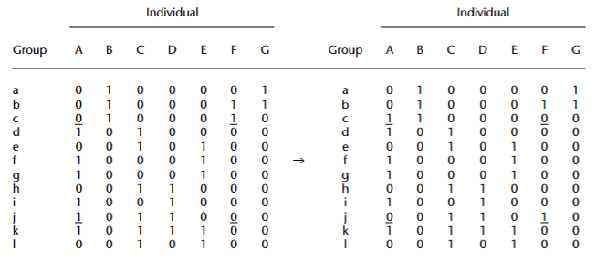
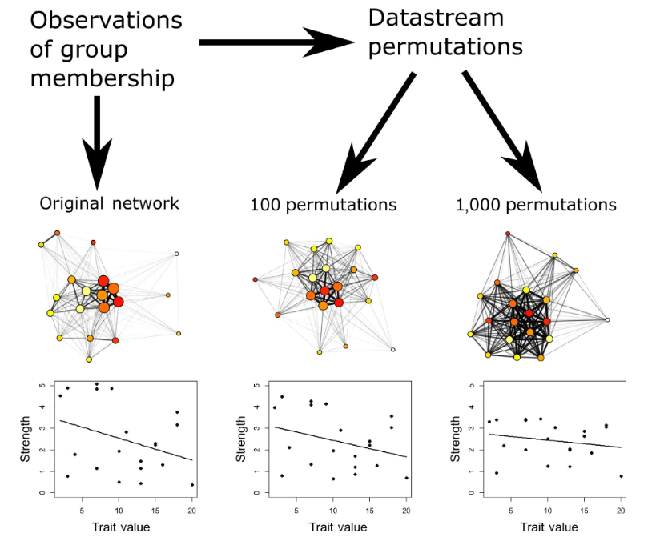

## Pre-network permutation  
### Pre-network permutationの手法  
Node permutationとともによく用いられるパーミュテーションの方法が、**pre-network (またはdata stream) permutation**である。この方法では、隣接行列(ネットワーク)を作成する前の生データに対してパーミュテーションを行う[@Farine2017]。  

Pre-network permutationは、もともと<u>"group by individual"(第\@ref(s2-2)節参照)形式のデータに適用するために考案された手法</u>である[@Bejder1998; @Whitehead1999]。このような形式のデータとしては、下のようなものがあげられる。これは、金華山島$B_1$群で2021年交尾期の各観察日(`date`)にそれぞれのメスが群れ内で観察されたか否かを示したものである。1が観察されたこと、0が観察されなかったことを表す。   
<br/>  

```{r, echo = FALSE}
presence <- read_csv("data/presence_demo.csv")

presence %>% 
  datatable(rownames = FALSE,
            options = list(scrollX = 50),
            filter = "top")
```
<br/>  

Pre-network permutationのプロセスを模式的に表したのが図\@ref(fig:fig-dsp)である[@Bejder1998; @Whitehead1999]。以下のプロセスで行う。  

1. "group by individual"形式のデータからランダムに2つのグループ(行)と2個体を選ぶ。ただし、各個体はいずれか一方のグループ(行)のみで確認され、かつ各グループ(行)ではいずれか一方の個体のみしか確認されていないものの中から選ぶ。例えば、図\@ref(fig:fig-dsp)の左の行列の下線の組み合わせがこのような条件を満たす。  

2. 2つのグループ(行)における各個体の数値を入れ替える(図\@ref(fig:fig-dsp)の右の行列)。  

3. 入れ替えた後のデータをもとにassociation index(e.g., SRIなど)を算出し、隣接行列(ネットワーク)を作成する。  

4. 2~3の過程を少なくとも1000回繰り返す。ただし、各ステップで入れ替えを行うデータは、前のステップで入れ替えを行った後のデータである。例えば図\@ref(fig:fig-dsp)では、次のステップにおいては右の行列(= 前のステップで入れ替えた後のデータ)に対してランダムな入れ替えを同様に行う。  

<br/>  
```{r fig-dsp, echo=FALSE, out.width="90%", fig.cap="Pre-network permutationのプロセス。Whitehead et al. (1999)から引用。"}

```
<br/>  

この方法を用いることで、**各グループ(行)で確認された個体数と、各個体が確認された回数を保ったまま**ランダムなネットワークを無数に生成することができる[@Farine2017]。また、ランダムに選ぶ2個体を同じ属性(e.g., 性別)の個体に限定したり、観察が複数の調査期間/場所で行われた際にそれぞれの調査期間/場所**内**で入れ替えを行ったりすることで、**node permutationで問題となっていた観察バイアスや観察場所・期間の影響を排除することができる**[@Whitehead2005]。  

検定を行う際には、node permutationのときと同様に、実データをもとに算出した統計検定量と、各ステップでランダムな入れ替えによって生成されたデータから算出された統計検定量の分布を比較することでP値を算出する。  

なお、pre-network permutationは近年適用範囲が広がり、"group by individual"形式のデータだけでなく、GPSデータや個体追跡データに対しても適用できるようになってきている。詳しい方法については、@Farine2017 を参照。  

### 分析例  
Pre-network permutationを用いた分析は、node permutationで行ったすべての分析(線形モデル、相関分析、MRQAP検定など)に対して適用することができる。  

ここでは、簡単な例としてGLMによる分析を行う。  

下のデータは、金華山島$B_1$群で2019～2021年において、各観察日(`date`)に各メスが観察されたか否かを"group by individual"形式で示したものである(`presence_multi`)。  
```{r, echo = FALSE}
presence_multi <- read.csv("data/presence_demo_multi.csv") 

datatable(presence_multi, rownames = FALSE)
```
<br/>  

このデータを用いてSRI(第\@ref(s2-2)節参照)を算出し、SRIネットワークにおける各個体の固有ベクトル中心性(`eigen`)が順位(`rank`)と年齢(`age`)と関連するかを調べたいとする。 なお、**pre-network permutationは、各観察年(`period`)内で行うものとする。**    

ここでは、以下のような一般化線形モデルを考える。  

- 分布: ガンマ分布  
- リンク関数: log関数  
- 応答変数: 固有ベクトル中心性(`eigen`)   
- 説明変数: 順位(`rank`)、年齢(`age`)   

#### `sna`パッケージを用いる方法  
まずは実データからSRIを算出して隣接行列を作成する(第\@ref(s2-2)参照)。  
```{r}
## 
presence_mat_multi <- get_network(presence_multi 
                                  ## 日付と調査期間は除く
                                  %>% select(-date, -period),
                                  data_format = "GBI",
                                  association_index = "SRI")
```

そこから`ANTs`パッケージで固有ベクトル中心性を算出し(第\@ref(s3-1)節参照)、メスの属性データに追加する。  
```{r}
## 属性データ 
att_females <- data.frame(femaleID = colnames(prox_mat),
                          rank = c(8,9,11,12,1,2,3,5,4,13,15,14,6,7,10),
                          age = c(12,9,10,10,14,7,12,8,6,8,10,15, 10, 10, 10))


att_eigen <- met.eigen(presence_mat_multi,
                       df = att_females,
                       dfid = 1)
```

算出したものがこちら。  
```{r, echo = FALSE}
datatable(att_eigen, rownames = FALSE)
```
<br/>  

その後、node permutationの時と同様に実データに対してモデリングを行い、統計検定量(= 係数の推定値)を求める。  
```{r}
r_glm_org <- glm(data = att_eigen,
                 formula = eigen ~ rank + age,
                 family = Gamma("log"))
```

推定結果は以下のようになる。  
```{r}
r_glm_org
```

係数の推定値を抽出する。 
```{r}
b_rank <- coef(r_glm_org)[[2]]
b_age <- coef(r_glm_org)[[3]]
```

```{r, echo = FALSE}
coef_real <- data.frame(b_rank = b_rank,
                        b_age = b_age) %>% 
  pivot_longer(cols = 1:2, names_to = "coef", values_to = "value") %>% 
  mutate(label = str_c("実測値: ", sprintf("%.2f", value)),
         y = c(800,600),
         c = c(0.0001, 0.0006)) %>% 
   mutate(coef = fct_relevel(coef, "b_rank"))
```

それでは、pre-network permutationを行い、それによって生成されたランダムなネットワークに対しても同様の分析を行って係数の推定値を抽出していく。パーミュテーションは10000回行うものとする。    

`sna`パッケージでは、`random_permutation`関数を用いてpre-network permutationを行うことができる。関数では、`locations =`、`days =`にデータの各行の観察場所/時間を、`classes =`に各個体の属性を指定できる。そのうえで、`within_location = TRUE`、`within_day = TRUE`、`within_class = TRUE`とすることで、各観察場所/期間**内**、あるいは同じ属性の個体同士でしかデータの入れ替えが行われないようにすることができる。今回は各観察年内で入れ替えを行うので、`days = period`とし、`within_period = TRUE`とする。  

```{r}
period <- presence_multi$period


set.seed(123)
presence_mat_rand <- network_permutation(presence_multi 
                                         %>% select(-date,-period),
                                         data_format = "GBI",
                                         association_index = "SRI",
                                         #パーミュテーション回数
                                         permutations = 10000,
                                         days = period,
                                         within_day = TRUE)
```

これで、ランダムなネットワークが10000個生成された。例えば、120個目のネットワークの隣接行列は以下のようになる(表\@ref(tab:tab-rand120))。  

```{r tab-rand120}
presence_mat_rand[120, , ] %>% 
  kable(digits = 2, align = "c", caption = "120個目の隣接行列") %>% 
  kable_styling(font_size = 6, full_width = FALSE)    
```
<br/>  

それでは、各ランダムネットワークに対してモデリングを行い、係数の推定値を抽出していく。`b_rank_rand`と`b_rank_age`という空のベクトルを作成し、そこにランダムネットワークから算出された係数の推定値を入れている。   
```{r}
## 空の行列を作成
b_rank_rand <- rep(0,10000)
b_age_rand <- rep(0,10000)

for(i in 1:10000){
  att_eigen_rand <- met.eigen(presence_mat_rand[i,,], df = att_females)
  r_glm_rand <- glm(data = att_eigen_rand,
                 formula = eigen ~ rank + age,
                 family = Gamma("log"))
  b_rank_rand[i] <- coef(r_glm_rand)[[2]]
  b_age_rand[i] <- coef(r_glm_rand)[[3]]
}
```

それでは、最後に実データの回帰係数をランダムネットワークの回帰係数の分布と比較する(図\@ref(fig:fig-npermtest-d))。灰色のヒストグラムがランダムネットワークの回帰係数の分布を、赤い線が実データの回帰係数を表している。

```{r fig-npermtest-d, echo = FALSE, fig.dim = c(10,4.5), fig.cap = "実データの回帰係数とランダムネットワークの回帰係数の分布の比較"}
labeller <- as_labeller(c("b_rank" = "順位の係数", "b_age" = "年齢の係数"),
                        label_parsed)

data.frame(b_rank = b_rank_rand,
           b_age = b_age_rand) %>% 
  pivot_longer(cols = 1:2, names_to = "coef", values_to = "value") %>% 
  mutate(coef = fct_relevel(coef, "b_rank")) %>% 
  ggplot(aes(x = value))+
  geom_histogram(bins = 200)+
  geom_vline(data = coef_real,
             aes(xintercept = value),
             color = "red4",
             linewidth = 1)+
  geom_text(data = coef_real,
            aes(label = label, x = value+c, y = y),
            fontface = "bold",
            family = "Yu Gothic")+
  theme(aspect.ratio = 1,
        strip.background = element_blank(),
        strip.text = element_text(hjust = 0, size = 20, family = "Yu Gothic"))+
  facet_rep_wrap(~coef, repeat.tick.labels = TRUE, scales = "free",
                 labeller = labeller)

p_rank <- sum(b_rank > b_rank_rand)/10000
p_age <- sum(b_age > b_age_rand)/10000
```
<br/>  

そこで、実データの回帰係数がランダムネットワークの回帰係数の何%より大きいか/小さいかを計算することで、$P$値を算出する。  
算出は以下のように行える。  

順位の係数については、P = `r sprintf("%.3f",p_rank)`なので、有意な関連はないよう(有意傾向)。  
```{r}
p_rank <- sum(b_rank > b_rank_rand)/10000

p_rank
```

一方で、年齢の係数($\beta_2$)については、P = `r sprintf("%.3f",p_age)`なので、有意である。    
```{r}
p_age <- sum(b_age > b_age_rand)/10000

p_age
```
<br/>  

#### `ANTs`パッケージを用いる方法
`ANTs`パッケージでも同じ同様の分析を行うことができる。`ANTs`パッケージではpre-network permutationを行う前に"group by individual"形式のデータを`gbi.to.df`関数で以下のように縦長のデータフレーム(`presence_df`)に直す必要がある。  
```{r}
## まずはマトリックスに直す。
presence_multi %>% 
  column_to_rownames(var = "date") %>% 
  select(-period) %>% 
  as.matrix()-> presence_multi_b

## gbi.to.df関数でデータフレーム形式に  
presence_df <- gbi.to.df(presence_multi_b)

## periodを追加
presence_df %>% 
  mutate(period = ifelse(year(scan) == "2019",1,
                         ifelse(year(scan) == "2020",2,3))) -> presence_df
```

このように、データフレームには観察した日付(`scan`)と観察された個体の名前(`ID`)が記されている。  
```{r}
presence_df %>% 
  datatable(rownames = FALSE)
```
<br />  

このデータフレームをもとに、`perm.ds.grp`関数でパーミュテーションを行うことができる。この際、`ctrlf = period`と指定することで、各観察年内で入れ替えを行うことができる。  
```{r}
set.seed(123)

perm_ds <- perm.ds.grp(presence_df_b,
                       ## 観察日
                       scan = "scan",
                       ## パーミュテーション回数
                       nperm = 10000,
                       ctrlf = "period",
                       index = "sri",
                       progress = FALSE)
```

これで、実データにもとづくネットワーク(隣接行列)1つと、ランダムネットワークが10000個生成された。各ネットワークにおける固有ベクトル中心性を算出し、それぞれをメスの属性データに追加していく。   
```{r}
## メスの属性データ
att_females <- data.frame(femaleID = colnames(prox_mat),
                          rank = c(8,9,11,12,1,2,3,5,4,13,15,14,6,7,10),
                          age = c(12,9,10,10,14,7,12,8,6,8,10,15, 10, 10, 10))

att_eigen_list <- met.eigen(perm_ds, 
                            df = att_females, 
                            dfid = 1)
```

続いて`stat.glm`関数を用い、実データとランダムネットワークにおけるデータに対してモデリングを行い、パラメータの推定値を算出する。 
```{r}
glm_ants <- stat.glm(ant = att_list, 
                       formula = eigen ~ age + rank,
                        family = Gamma(link = "log"),
                        ## 実データのデータフレーム
                        oda = presence_df,
                        progress = FALSE)
```

分析結果は、`ant`関数を用いることで確認できる。  
実データの回帰係数とランダムネットワークの回帰係数の分布の比較は以下のように可視化できる(図\@ref(fig:fig-npermtest-e))。  
```{r fig-npermtest-e, fig.dim = c(12,5.5), fig.cap = "実データの回帰係数とランダムネットワークの回帰係数の分布の比較"}
r_glm_ants <- ant(glm_ants)
```
<br/>  

検定結果は以下の通り。`p.left`と`p_right`はランダムネットワークの係数が実際の係数よりも小さい/大きい確率を表す。`sna`パッケージを用いた場合と少し異なる結果が得られており、順位の関連も有意である。この違いはパッケージごとのアルゴリズムの違いに起因？  
```{r}
r_glm_ants$model
```

### Pre-network permutationの欠点  
以上のように、pre-network permutationは観察バイアスや観察場所/期間の影響を排除することのできる強力な手法であり、多くの研究で用いられている[@Farine2015; @Farine2017; @Farine2022]。一方で、ここ数年の研究によって**pre-network permutationは相関分析や回帰分析の検定を行う手法としては適切でない**ことが指摘されるようになっている[@PugaGonzalez2021; @Weiss2021; @Farine2022]。  

回帰分析を例にとって考えてみよう。回帰分析の目的は説明変数(X)と応答変数(Y)に関連があるかを調べることなので、その帰無仮説は「両者の間に関連がない($\beta = 0$)」である。Node permutationでは隣接行列の行と列に対してパーミュテーションを行うことで、ネットワークの構造自体は保ちつつ、XとYの関連がランダムなネットワークを作り出すことができていた(第\@ref(s4-1)節と第\@ref(s4-2)節を参照)。  

一方で、pre-network permutationは生のassociation/交渉データに対してパーミュテーションを行うので、ネットワークの構造自体に大きな変化が生じてしまい、辺の重みや中心性指標の分布が大きく変わってしまう[@Weiss2021]。その結果、現実世界における辺の重みや中心性指標の分布からは乖離してしまい、適切な帰無分布にならなくなってしまう可能性がある[@Farine2022]。一般的に、pre-network permutationによって辺の重みや中心性指標の分布のばらつきは小さくなってしまうので(つまり、実際のデータの値のほうが極端になる傾向があるので)、第一種の過誤を犯す確率が高くなってしまう(図\@ref(fig:fig-prenetwork))。  

<br/>  
```{r fig-prenetwork, echo=FALSE, out.width="90%", fig.cap="Pre-network permutationを繰り返すことで値の分布のばらつきが小さくなる。Weiss et al. (2021)から引用。"}

```
<br/>  

この問題を解消するため、@Farine2022 はnode permutationとpre-network permutationの手法を組み合わせた**double permutation**法を提唱し、この手法を用いることでそれぞれの手法を単独で用いるよりも誤った結論を導いてしまう可能性が低くなることを指摘している。一方で @Weiss2021 は、①Generalized affiliation indicesなどの交絡要因をはじめから除外できる指標を用いること、②観察バイアスや観察場所や期間の情報を明示的にモデルに取り込むこと(e.g., 観察回数を説明変数に入れたり、ランダム効果に場所や期間を入れるなど)[c.f. @Franks2021]でnode permutationだけでも適切な検定ができることを指摘している。  

いずれにしても、ここ数年だけでもパーミュテーション検定の妥当性を検証する論文が多数出ていることからもわかるように[@Evans2020; @Franks2021; @PugaGonzalez2021; @Farine2022; @Hart2022; @Weiss2021]、どのような分析方法が最も適切かについてはまだ結論が出ていないのが現状だ。今後新たにどのような検証結果が出るかに注視していく必要があるだろう。  


