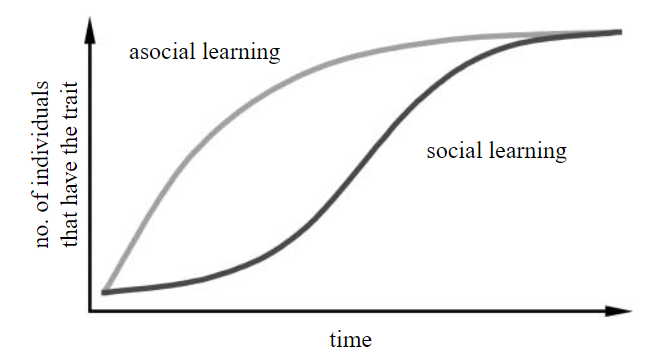

# ネットワークベース拡散分析(NBDA) {#c5}  
## ネットワークベース拡散分析とは {#s5-1}   
**社会的学習**(social learning)とは、同種個体やその産物を観察したり、他個体と交流したりすることによって影響を受ける学習のことを指す。また、社会的学習によってある行動形質が集団内に広がるとき、それをを社会的伝達(social transmission)という[@Hoppitt2011]。ヒトの社会的学習能力は他の類人猿と比べても顕著に高く[@Herrmann2007]、ヒトが多様な環境に適応して繫栄することができたのは、この能力に依るところが大きいと考えられている[@Henrich2015]。近年、多様な種において社会的学習が見られることが明らかになっており[cf. @Galef2005]、社会的学習能力がどのように進化してきたかを探るために数多くの研究が行われている。  

野生の動物を対象に社会的学習・社会的伝達が生じているかを調べるとき、これまでは主に以下のような方法がとられてきた。  

1. **「民族誌」的方法**: 複数の地域個体群における行動レパートリーを調べる。その違いが遺伝的・環境的要因によるものでなければ、それぞれの地域個体群で行動レパートリーが社会的伝達によって広まったものであるとみなすという方法[@Whiten1999; @Perry2003; @VanSchaik2003; @Nakagawa2015]。  

2. **拡散曲線分析(diffusion curve analysis: DCA)**: 行動を獲得した累積個体数を経過時間を横軸にとってプロットし(= 拡散曲線)、それに数理的なモデルを当てはめる方法[@Franz2009; @Hoppitt2011]。もし学習が社会的であれば、すでに学習した個体が多いほどモデル(手本)が増えて未学習の個体が新たに学習する確率が増加するので、S字型の曲線になる(図\@ref(fig:DCA))。一方で、学習が非社会的(= 試行錯誤学習)であれば、未学習の個体が新たに学習する確率は常に一定なのでr字型の曲線になる(図\@ref(fig:DCA))と予想される。  
```{r DCA, out.width = "60%", fig.align = "center", echo = FALSE, fig.cap = "社会的学習・非社会学的学習のときに数理モデルから予測される曲線。Franz & Nunn(2009)から引用。"}  

```
<br/>  

しかし、1の方法では遺伝や環境の影響を完全に排除することが難しいため、実際には遺伝や環境による違いによるものを社会的学習によるものとみなしてしまう可能性があるとの批判がある[e.g., @Laland2006]。また2の方法についても、近年の理論的研究から拡散曲線をもとにした学習メカニズムの推定は信頼性が低いことが指摘されるようになっている[@Franz2009; @Hoppitt2011]。こうした状況を受け、学習が社会的か否かを分析するより信頼性の高い方法として、**ネットワークベース拡散分析(network-based diffusion analysis: NBDA)**が開発された[@Franz2009;@Hoppitt2010; @Hoppitt2011; @Hoppitt2017; @Hasenjager2021]。  

NBDAとは、ある行動形質の拡散パターンが社会学習の潜在的機会を表すと考えられる社会ネットワーク(e.g., 毛づくろい、採食、近接ネットワークなど)に沿っているかを統計的に分析することで、学習が社会的に生じているか否かを検討する方法である[@Franz2009; @Hoppitt2010; @Hoppitt2011]。この分析は、<u>もし社会的学習が生じているのであれば、社会的ネットワーク上でつながりが強い個体同士で学習が起きる可能性が高い</u>というということを前提にしている。NBDAでは非社会的学習に対して社会的学習がどの程度強く働いているかを推定することで、遺伝的・系統的・環境的要因などの非社会的要因が学習に与える影響を検討することもできる。  

NBDAはこれまでに様々な種を対象とした研究に適応され、その過程で様々な拡張がなされてきた[@Hoppitt2011; @Hasenjager2021]。例えば、行動を学習したタイミングが正確にわからなくても、学習した順番のデータがあれば適用できるように拡張されたり(order of acquisition analysis: OADA)、個体の情報(順位、性別、年齢)を考慮できるように拡張されたり、複数の社会ネットワークを通した社会的伝達を分析できるように拡張されたりしている。こうした拡張はRの`NBDA`パッケージ[@Hoppitt2019]によって実装されており、 @Hasenjager2021 がそれぞれのモデルの解説やRでの実行方法をまとめている。そこで以下では、主に @Hasenjager2021 を参考にNBDAとそれを拡張したモデルについて解説を行うとともに、それらをRで実行する方法についてまとめる。  


