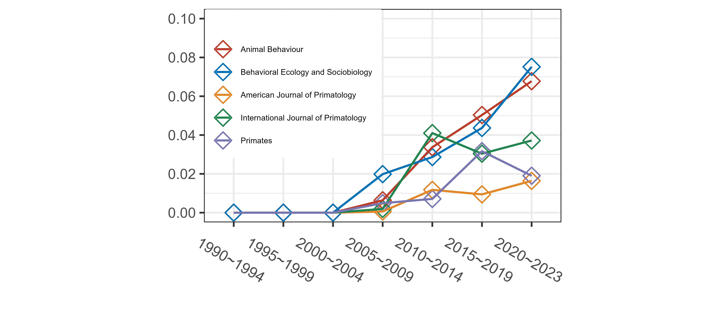

# 本稿の目的   
本稿はネットワーク分析の簡単な概要と、Rで分析を行う方法をまとめたものである。本文は[こちらから](https://tsubasayamaguchi-jinrui.github.io/Network_Analysis_Using_R/)。 

近年、動物行動学や霊長類ではSNAの手法を用いた研究が増加しており(Sueur et al. 2011)、Primatesでも2019年に特集号が組まれた[Puga-Gonzalez et al., 2019]。下図は、Google Scholarを用いて、動物行動学や霊長類学の分野で著名な学術雑誌において、"social network analysis"という単語を含む論文の割合を示したものである(2023年1月22日時点)。私たちが普段読むことが多いこれらの雑誌においても、2000年代後半以降社会ネットワーク分析を用いた論文が増加していることが示唆される。  

こうした論文を適切に理解するためにも、SNAについてある程度理解することは有用だといえる。また、自身のデータを解析するする手法を増やすことは、研究の幅を広げることにもつながるだろう。  

 

本稿で扱うのは、以下の内容である。

- 社会ネットワーク分析の概要(第1章)
- rawデータからマトリックス(隣接行列)を作成する方法(第2章)  
- 各ネットワーク指標の解説と算出法(第3章)   
- ネットワークデータでの統計分析（第4章)  

参考にしたのは主に以下の文献である。  
なお、本稿の作成に使用したファイルとRのコードは筆者のGitHubですべて閲覧できる。  

- 鈴木努(2017) ネットワーク分析 第2版  
- Whitehead(2008) Analyzing Animal Societies  
- Croft et al. (2008) Exploring Animal Social Network 
- Farine & Whitehead (2015) Constructing, conducting and interpreting animal social network analysis 
- Farine (2017) A guide to null models for animal social network analysis
- Sosa et al. (2020) A multilevel statistical toolkit to study animal social networks: the Animal Network Toolkit Software (ANTs) R package.
- Borgatti et al.(2022) Analyzing Social Networks Using R. 
- Network Analysis in R ([Dai Shizukaのホームページ](https://dshizuka.github.io/networkanalysis/tutorials.html))  

