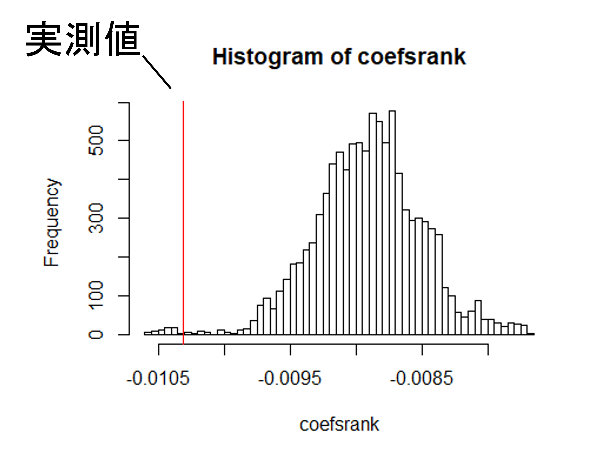

```{r, echo = FALSE}
knitr::opts_chunk$set(echo = TRUE, message = FALSE,
                      warning = FALSE, fig.align = "left",
                      cache = TRUE)
```

# 本稿の目的  
本稿では、Rでネットワーク分析を行う方法をまとめたものである。  
本稿では、主に以下の内容を扱う。  

# 0. パケージの読み込み  
主に以下のパッケージを用いる。  
詳細は以下のサイトを参照。  
[asnipe](https://rdrr.io/cran/asnipe/man/asnipe-package.html)[@Farine2013]  
[ANTS](http://www.s-sosa.com/ants)[@Sosa2020]  
[sna](https://rdrr.io/cran/sna/)[@Butts2008]  
```{r}
library(asnipe)
library(ANTs)
library(sna)
library(tidyverse)
```

# 1. なぜネットワーク分析が必要か？

# 1. データの読み込みとマトリックスの作成  
個体のassociationを表すデータには、既にマトリックス(隣接行列)になっているもの以外にも様々な表し方をしたものがある。  
以下では、様々な形式のデータからマトリックスを作成する方法を学ぶ。  

## 1.1 交渉を記録したデータフレーム  
例えば、以下は金華山島$B_1$群で2018年時点で6歳以上のメスを個体追跡した際のデータであり、1分間の瞬間サンプリングで以下を記録したデータフレーム。    
- 追跡個体の活動(G: 毛づくろい、R: 休息、F: 採食、M: 移動、O: その他)  
- 追跡個体が毛づくろいした場合には毛づくろいをした個体(Groomer)とされた個体(Groomee)

```{r}
groom <- read_csv("data/focal_demo.csv")

groom %>% 
  filter(activity == "G")
```

追跡したメスのIDは以下のとおりである。  
```{r}
adult <- adult <- c("Kil","Kit","Koh","Kur","Kun","Kor","Ntr",
           "Ten","Aka","Ako","Tam","Tot","Hen","Hot",
           "Mal","Mik","Mei")
```


このデータをもとに、個体追跡中にメス間が毛づくろいをした頻度を示したマトリックスを作成する。  
ここで、頻度は以下の式で表すものとする。  

$G_{AB}$: AからBへの毛づくろい頻度  
$x_{AB}$: AからBへの毛づくろいが確認された瞬間サンプリングポイント数  
$y_A$: Aの個体追跡時間(瞬間サンプリングポイント総数)  
$y_B$: Bの個体追跡時間(瞬間サンプリングポイント総数)  

$$
G_{AB} = \frac{x_{AB}}{y_{A} + y_{B}} 
$$

各個体の追跡時間(瞬間サンプリングポイント総数)を算出する。  
```{r}
groom %>% 
  group_by(subject) %>% 
  summarise(duration = n()) -> duration

duration
```

マトリックスは`ANTs`パッケージを用いて以下のように算出できる。  
```{r}
## メス同士が毛づくろいをしている行のみを抽出
groom_G <- groom %>% 
  filter(activity == "G") %>% 
  filter(Groomer %in% adult & Groomee %in% adult)

groom_mat <- df.to.mat(groom_G, 
                       ## 行動の行い手を表す列  
                       actor = "Groomer",
                       ## 行動の受け手を表す列
                       receiver = "Groomee",
                       ## 追跡時間
                       tobs = duration$duration,
                       sym = FALSE)
```

```{r}
groom_mat %>% 
  data.frame()
```


もし交渉の方向性を考慮しない場合は、`sym = TRUE`とすればよい。  
```{r}
groom_mat_b <- df.to.mat(groom_G, 
                       ## 行動の行い手を表す列  
                       actor = "Groomer",
                       ## 行動の受け手を表す列
                       receiver = "Groomee",
                       ## 追跡時間
                       tobs = duration$duration,
                       sym = TRUE)
```

```{r}
groom_mat_b %>% 
  data.frame()
```

## 1.2 Group by individual  
その他にも、以下のようにある時点・場所において確認された個体を0/1で記録した"group by individual"と呼ばれる形式のものもある。  
例えば、以下は2021年交尾期の各観察日にメスが観察されたか否かを示したものである。  
```{r}
presence <- read_csv("data/presence_demo.csv")

presence
```

このようなデータは、同じグループで観察された個体をassociateしていたとみなす(=gambit of the group)。  
`asnipe`では、こうしたデータから以下のような指標についてマトリックスを作成することが可能である。  
各指標については、以下を参照[@Hoppitt2018]。  
- HWI: half-weight index   
- SRI: simple ratio index  

```{r}
presence_mat <- get_network(presence %>% dplyr::select(-date),
                            data_format = "GBI",
                            ## "HWI"の場合は、"HWI"
                            association_index = "SRI")
```

```{r}
presence_mat %>% 
  data.frame()
```

# 2. 各ネットワーク指標の算出  
ここでは、`ANTs`パッケージを用いてマトリックスから様々なネットワーク指標を求める(他の様々なパッケージでも求められる)。    
各指標については、Sosa et al. (2020)やFarine & Whitehead(2015)などを参照[@Sosa2020; @Farine2015]。  

- 重みづけ中心性(strength)  
- 固有ベクトル中心性(eigenvector centrality)  
- 次数中心性(degree)  
- 媒介中心性(betweenness)など...     

`ANTs`パッケージを用いれば、属性データ(年齢や順位などの情報)と結合することができる。  
2018年時点の属性データは以下の通り。  
```{r}
attribute <- read_csv("data/attributes_demo.csv")

attribute
```

ここでは、上記で作成したの毛づくろいネットワーク(`groom_mat`)を用いる。  
以下のように属性に次々と指標を付け足していくことができる。
```{r}
## 重みづけ中心性(strength)
met.strength(groom_mat, 
             df = attribute,
             ## 個体IDの列番号
             dfid = 1) -> female_metrics

## 固有ベクトル中心性  
met.eigen(groom_mat, 
             df = female_metrics,
             ## 個体IDの列番号
             dfid = 1) -> female_metrics

female_metrics
```

# 3. 統計的検定  
マトリックス内の数値やそこから算出されたネットワーク指標は他の個体の指標と互いに関連しあっているため、独立ではない[@Farine2015; @Farine2017]。  
そのため、統計的検定を行う場合には、randomizationテストを行う必要がある。randomizationには、いくつかの方法がある。  

## 3.1 node label randomization  
ネットワークのnode(点)のラベルをランダムにシャッフルし、そうしてできた多数のランダムなネットワークにおける分析結果(例えば、相関係数や回帰分析の係数)を帰無モデルとし、それと実際に得られたネットワークにおける分析結果と比較することで、有意性を判定する方法である[@Farine2015; @Farine2017]。  
  


`ANTs`パッケージを用いることで容易に求めることができる。  

### 3.1.1 線形回帰分析  
例えば、上(1.1)で求めた毛づくろいネットワークにおいて、順位や年齢と固有ベクトル中心性に関連があるか知りたいとする。  
以下のような一般化線形モデルを考える。  

- 分布: 正規分布  
- 応答変数: 固有ベクトル中心性  
- 説明変数: 順位、年齢  

それでは、node label permutationを行う  
ここでは、従属変数のラベルをランダム化する。
```{r, warning = FALSE, message = FALSE}
#perm_glm <- perm.net.nl(female_metrics,
 #                       ## ランダマイゼーションするラベル  
  #                      labels = "eigen",
   #                     ## 回数  
    #                    nperm = 10000)

perm_glm <- readRDS("output/perm_glm.rds")
```

分析は以下の通り。  
```{r}
#r <- stat.glm(perm_glm,
 #             formula = eigen ~ age + rank,
  #            family = "gaussian")

r <- readRDS("output/r.rds")
```

ランダムなネットワークにおける係数と実際のネットワークにおける係数の比較。  
```{r}
r_ant <- ant(r)
```

結果は以下の通り。  
有意な結果は得られなかった。
```{r}
r_ant$model
```

モデル診断。
```{r}
r_ant$model.diagnostic
```

GLM以外にも、t検定や相関分析、GLMM等を同様に行うことができる。  

### 3.1.2 ネットワーク同士の関連の検討  
node label randomizationによってネットワーク同士の関連を調べることもできる。  
例えば、上(1.2)で求めたメスが一緒に確認される割合が、個体間の血縁度や順位差と関連しているか調べるとする。  
イメージとしては、以下のようにネットワーク同士で回帰分析を行うような感じである。  
このような分析をMRQAP検定という[@Dekker2007]。


分析には、[aninetパッケージ](https://rdrr.io/github/MNWeiss/aninet/man/)を用いる[@Franks2021]。  
```{r}
library(aninet)
```

血縁と順位差マトリクスの読み込み。  
```{r}
kin_mat <- read.csv("data/kin_demo.csv", row.names=1) %>% 
  as.matrix()

rank_mat <- read.csv("data/rank_demo.csv",row.names = 1) %>% 
  as.matrix()

## マトリクスの順番を合わせる
presence_mat <- presence_mat[rownames(kin_mat),rownames(kin_mat)]
```


`glmqap()`関数を用いれば様々な分布を用いたモデリングを行うことができる。  
ここでは、SRIを応答変数とするので、二項分布を用いたモデリングを行う。  
SRIの分母を以下のようにして求める。  
```{r}
denom <- get_denominator(presence %>% dplyr::select(-date),
                         return = "matrix",
                         index = "SRI")

denom <- denom[rownames(kin_mat),colnames(kin_mat)]
```

分析は以下の通り。  
```{r}
#r_qap <- glmqap(presence_mat ~ rank_mat + kin_mat,
 #               ## 分母のマトリクス
  #              weights = denom,
   #             family = "binomial",
    #            nperm = 10000,
     #           permutation = "DSP"
      #        )

r_qap <- readRDS("output/r_qap.rds")
```

結果は以下の通り。  
```{r, echo = FALSE}
r_qap$coefficients %>% 
  data.frame() %>% 
  bind_cols(r_qap$stderr %>% data.frame()) %>% 
  bind_cols(r_qap$z %>% data.frame()) %>% 
  bind_cols(r_qap$p %>% data.frame()) %>% 
  set_names("推定値","SE","z値","p値") %>% 
  datawizard::rownames_as_column(var = "説明変数") %>% 
  mutate(説明変数 = str_replace_all(説明変数, c("\\(Intercept\\)" = "切片",
                                        "xkin_mat" = "血縁度",
                                        "xrank_mat" = "順位差"))) 
```

## 3.2 data stream randomization  
マトリクスを作る前にランダマイゼーションを行うpre-network randomizationという方法もある。  
代表的なものはdata stream randamizationと呼ばれるものである。詳しくは、Farine & Whitehead (2015)参照。  
<br />  

ANTsパッケージでdata stream randomizationを行うことができる。  
ここでは、group by individualの形式で記録したメスの出欠データ(1.2参照)を用いる。  
ランダマイゼーションを行うためには、縦長のデータフレームにする必要がある。  
```{r}
## まずはデータフレームの形に直す。
resence_mat <- presence %>% column_to_rownames("date") %>% 
  as.matrix()

## gbi.to.df関数でデータフレーム形式に  
presence_df <- gbi.to.df(presence_mat)
```

`perm.ds.grp()`でdata stream randomizationを行うことができる。  
ここでは、観察日ごとに個体の出欠を10000回シャッフルするが、もしあれば時間や場所などの情報も`ctrlf`という引数で加えることが可能である。詳しくは、Farine (2017)を参照。
```{r}
#perm_ds <- perm.ds.grp(presence_df,
 #                      scan = "scan",
  #                     nperm = 10000,
   #                    index = "sri")

perm_ds <- readRDS("output/perm_ds.rds")
```

生成された10001(実データ1 + ランダマイゼーション×10000)それぞれについて、ネットワーク指標を算出して、メスの属性データと結合する。やり方は、第2節と同様であるが、`map()`を用いることで10001個のマトリクスそれぞれについて算出できる。    
```{r}
## メスの属性データ
attribute_b <- attribute %>% 
  filter(femaleID != "Tam"&femaleID != "Kur") %>% 
  arrange(femaleID)

list <- map(perm_ds,met.eigen, df = attribute_b, dfid = 1)
```

それでは、算出した値を用いて統計的検定を行う。  
3.1.1と同様に、以下のような線形モデルを考える。  
以下のような一般化線形モデルを考える。  

- 分布: ガンマ分布  
- 応答変数: 固有ベクトル中心性  
- 説明変数: 順位、年齢  

まず、算出したネットワーク指標を一つのデータフレームにまとめ、マトリクスごとにネスト化する。  
```{r}
for(i in 2:10001){
    if(i == 2){
    female_met <- bind_rows(list[[i-1]],list[[i]])
    } else{
    female_met <- bind_rows(female_met,list[[i]])
  }
 }

female_met %>% 
  mutate(perm.no = rep(1:10001,each = 15)) %>% 
  group_by(perm.no) %>% 
  nest() -> female_met_nest
```

`map()`を用いて、それぞれのマトリクスごとにGLMを行う。  
```{r}
r_ds <- map(female_met_nest$data, ~ glm(formula = eigen ~ rank + age, data = .,family = "Gamma"))
```

例えば、1つめのマトリクス(ここでは実測値)の結果は以下のようになる。   
ここで算出されているp値はこんかいは用いることができない(データの独立性を仮定した結果なので)。  
得られた係数(Coefficient)をランダム化されたマトリクスを用いた分析の係数と比較することで有意性を判定する。
```{r}
library(easystats)
model_parameters(r_ds[[1]])

coef_rank_r <- r_ds[[1]]$coefficients[[2]]
coef_age_r <-  r_ds[[1]]$coefficients[[3]]  
```


ランダム化された10000個のマトリクスで算出された順位と血縁の係数をまとめたデータフレームを作成する。  
```{r}
coef <- data.frame(coef_rank = 0L,
                   coef_age = 0L) 

for(i in 2:10001){
  coef[i-1,1] <- r_ds[[i]]$coefficients[[2]]
  coef[i-1,2] <- r_ds[[i]]$coefficients[[3]]
}
```

実データの係数がランダム化されたマトリクスの係数のうち95%よりも大きい/小さいときに、実データの係数は有意に大きい/小さいとする。  

**順位**については、以下のような結果になるので(p_upper = 0.0426)、順位の係数はランダムな場合よりも有意に大きい(＝固有ベクトル中心性に有意に正の関連がある)ということができる。    
```{r}
p_upper1 <- sum(coef$coef_rank > coef_rank_r)/10000
p_lower1 <- sum(coef$coef_rank < coef_rank_r)/10000

p_upper1
p_lower1
```

```{r}
coef %>% 
  ggplot(aes(x=coef_rank))+ 
  geom_histogram(bins = 500)+
  geom_vline(xintercept = coef_rank_r,
              color = "red")+
  geom_text(aes(x = 0.0053, y = 60),
            label = str_c("実測値\n","p_upper =", p_upper1),
            hjust=0)+
  theme_bw()
```

**年齢**については、以下のような結果になるので(p_upper = 0.057)、有意な影響はないとなる。     
```{r}
p_upper2 <- sum(coef$coef_age > coef_age_r)/10000
p_lower2 <- sum(coef$coef_age < coef_age_r)/10000

p_upper2
p_lower2
```

```{r}
coef %>% 
  ggplot(aes(x=coef_age))+ 
  geom_histogram(bins = 500)+
  geom_vline(xintercept = coef_age_r,
              color = "red")+
  geom_text(aes(x = 0.045, y = 65),
            label = str_c("実測値\n","p_upper =", p_upper2),
            hjust =0)+
  theme_bw()
```

## おまけ. CSIの算出  
`aninet`パッケージを用いれば、CSI[@Silk2006]を容易に算出できる。  
上で算出すしたメス間の毛づくろいマトリクスと、以下の近接マトリクスを用いて算出する。  
```{r}
prox_mat <- read.csv("data/prox_f.csv",row.names=1) %>% 
  as.matrix()

rownames(prox_mat) <- colnames(prox_mat)

prox_mat %>% 
  data.frame()
```

毛づくろいマトリクスからKurのデータを除く(近接マトリクスと合わせるため)。  
```{r}
groom_mat_b <- groom_mat_b[-10,-10]
```

CSIは以下のように求められる。  
3つ以上の数値を用いる場合でも、リストに追加していくだけで容易に求まる。  
```{r}
## 2つのマトリクスをリスト化
list <- list(groom_mat_b, prox_mat)
CSI <- dyadic_csi(list)
```

マトリクスは以下の通り。  
```{r}
rownames(CSI) <- rownames(prox_mat)
colnames(CSI) <- colnames(prox_mat)

CSI %>% 
  data.frame()
```

# 実行環境  
```{r}
sessionInfo()
```


# Reference  
